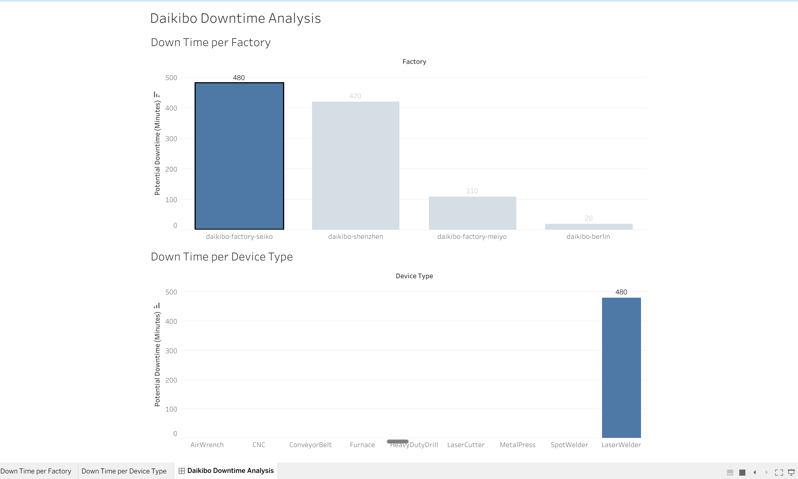

# Task 1 — Operational Downtime Analysis

## Business Objective

Analyze Daikibo machine telemetry data to identify factories experiencing the highest potential downtime and determine which device types contribute most to downtime.

The objective was to transform raw telemetry data into an interactive, business-facing Tableau analysis that could support operational investigation.

---

## Analytical Approach

The analysis followed four steps:

1. Define a potential downtime metric from machine health status.
2. Compare potential downtime across factories.
3. Analyze downtime by device type.
4. Build an interactive dashboard where selecting a factory filters the device-level analysis.

---

## 1. Downtime Metric

Each `unhealthy` machine status represents **10 minutes of potential downtime** for this simulation.

The Tableau calculated field used was:

```
text
IF [Status] = 'unhealthy' THEN 10
ELSE 0
END
```

The resulting measure was aggregated using `SUM(Unhealthy)`.

### 2. Factory analysis

Potential downtime was aggregated by `Factory` to compare operational impact across locations.

| Factory | Potential Downtime |
|---|---:|
| daikibo-factory-seiko | **480 minutes** |
| daikibo-shenzhen | **420 minutes** |
| daikibo-factory-meiyo | **110 minutes** |
| daikibo-berlin | **20 minutes** |

**Daikibo Factory Seiko recorded the highest potential downtime at 480 minutes.**

### 3. Device analysis

Potential downtime was aggregated by `Device Type`.

### 4. Interactive filtering

The factory chart was configured as a dashboard filter. Selecting a factory dynamically filters the device-type chart to that factory.

## Key Finding

The highest potential downtime was recorded at:

**daikibo-factory-seiko — 480 minutes**

With Seiko selected, the device-level analysis shows:

**LaserWelder — 480 minutes**

This identifies the location and device type that warrant further operational investigation.

> The analysis identifies an association in the telemetry data. It does not by itself establish the root cause of the downtime.

## Dashboard



## Tools

- Tableau
- JSON telemetry data
- Calculated fields
- Interactive dashboard filtering
